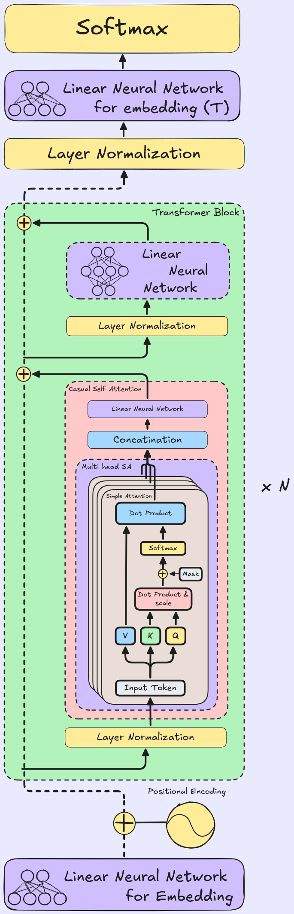

# GPT-2 Implementation

This repository contains a custom GPT-2 implementation that can be trained from scratch or loaded with OpenAI's pretrained weights. It now ships with a full-stack web app for interactive text completion.

## Model Overview

| Transformer Architecture | Model Architecture Diagram |
| :----------------------- | :------------------------- |
| **Generative Pre-trained Transformer (GPT-2)**<br><br>The model is built using a decoder-only Transformer architecture.<br><br>**Key Features:**<br><ul><li>**Token & Positional Embeddings:** Converts input tokens into continuous vectors and adds position information.</li><li>**Transformer Blocks:** A sequence of identical layers, each containing:<ul><li>*Masked Multi-Head Self-Attention:* Allows the model to selectively focus on relevant preceding tokens while preventing attention to future tokens.</li><li>*Layer Normalization:* Applied before the attention and feed-forward networks for training stability.</li><li>*Feed-Forward Network:* A Multi-Layer Perceptron applied to each token independently.</li></ul></li><li>**Output Head:** Projects the final hidden states back to the vocabulary size to predict the next token probabilities.</li></ul> |  |

<br>

### Specifications & Capabilities

- **Train on Your Own Data:** The codebase allows you to easily plug in your custom text datasets to train the transformer from scratch.
- **Load Pretrained Weights:** You can load the official pretrained weights from OpenAI's GPT-2 directly into this model architecture for inference and fine-tuning.

---

## Project Structure

```
GPT2/
├── GPT2.ipynb              # Training & exploration notebook (stays in root)
├── hf_transformer.ipynb
├── requirements.txt        # Root deps (notebook + backend)
├── docker-compose.yml      # Orchestrates backend + frontend
├── .gitignore
├── README.md
│
├── Models/                 # Saved model weights (not tracked by git)
│   └── GPT2-Pretrained.pth
│
├── Data/                   # Training data (not tracked by git)
│
├── backend/                # FastAPI REST API
│   ├── main.py             # API endpoints
│   ├── model.py            # GPT-2 model classes
│   ├── requirements.txt
│   └── Dockerfile
│
└── frontend/               # Single-page web app
    ├── index.html
    ├── style.css
    ├── app.js
    ├── Dockerfile
    └── nginx.conf
```

---

## 🐳 Docker Quick Start

> **Prerequisites:** Docker Desktop installed and running, model weights present at `Models/GPT2-Pretrained.pth`.

```bash
# Clone / enter project
cd GPT2

# Build and start both services
docker-compose up --build
```

| Service  | URL                       |
|----------|---------------------------|
| Frontend | http://localhost:3000     |
| Backend  | http://localhost:8000     |
| API Docs | http://localhost:8000/docs|

---

## API Reference

### `GET /health`
Returns backend and model status.

```json
{
  "status": "ok",
  "model_loaded": true,
  "device": "cuda",
  "model_path": "/Models/GPT2-Pretrained.pth",
  "load_time_s": 4.2,
  "error": null
}
```

---

### `POST /generate`
Generate a text continuation.

**Request:**
```json
{
  "prompt": "The quick brown fox",
  "max_new_tokens": 50,
  "temperature": 0.9,
  "top_k": 50
}
```

**Response:**
```json
{
  "generated_text": "The quick brown fox jumped over the lazy...",
  "prompt_tokens": 5,
  "new_tokens": 50,
  "device": "cuda"
}
```

---

### `POST /predict`
Get top-N next token probabilities.

**Request:**
```json
{
  "prompt": "The quick brown fox",
  "temperature": 1.0,
  "n_predict": 10
}
```

**Response:**
```json
{
  "top_predictions": [
    { "word": " jumped", "probability": 0.182 },
    { "word": " leaped", "probability": 0.091 },
    ...
  ],
  "device": "cuda"
}
```

---

## Frontend Features

- **Writing Ground** — Monospace editor with contenteditable, formatted for long-form text
- **Ghost Text** — Top-5 predicted words shown inline in dim gray; press **Tab** or **→** to accept
- **Probability Sidebar** — Top 10 next words with animated probability bars; click any to insert
- **Controls** — Temperature slider, Max tokens input, Top-K input
- **Generate Button** — Generates and appends a full continuation (`Ctrl+Enter`)
- **Health Badge** — Live status indicator showing model load state and device (CPU/CUDA)

---

## Local Development (without Docker)

```bash
# Install deps
pip install -r requirements.txt

# Run backend
cd backend
MODEL_PATH=../Models/GPT2-Pretrained.pth uvicorn main:app --reload --port 8000

# Serve frontend (separate terminal, any static server)
cd frontend
python -m http.server 3000
# Then change API_BASE in app.js from "/api" to "http://localhost:8000"
```
